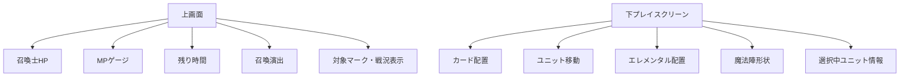
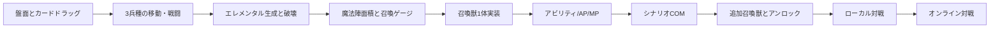

# 悠久の車輪 再現調査報告書

## Executive Summary

『悠久の車輪 ～Eternal Wheel～』は、タイトーとスクウェア・エニックスの協業で立ち上げられた、**カードを実際にプレイスクリーン上で動かしてユニットを操作する**オンライン対戦型アーケードカードゲームです。2007年のAOU出展・ロケテストを経て、2008年3月11日に初期出荷版が稼働し、2011年8月31日にネットワークサービスが終了しました。システム基板は **TAITO Type X2**、店舗設置形態は **メインユニット（ターミナル）＋サテライト筐体** で、AOU 2007 では8台のサテライトと1台のターミナルが展示されました。公式サイト `http://yu-sha.net/`、公式ブログ `http://fun.taito.co.jp/yu_sha/` は当時存在し、タイトーテックのお知らせページには「取扱説明書・訂正書」への導線が現在も残っています。 citeturn9view3turn21search2turn21search0turn37search2turn39search1turn22search5turn7search4turn7search10

ゲームの中核は、**エレメンタル配置 → 魔法陣形成 → 召喚ゲージ蓄積 → 召喚獣召喚 → 敵召喚士へのダメージ** という循環にあります。勝利条件は「相手召喚士HPを0にする」または「制限時間終了時の残HP優勢」で、カードデッキは **LV合計10** で構築します。ユニットの三兵種はキーパー・シーカー・マスターで、それぞれ近接制圧、高速展開、遠距離支援という役割に分かれています。アビリティは **AP満タンで任意発動**、スキルは **条件成立時に自動発動** です。 citeturn41search9turn42search11turn41search3turn14view0turn44view1turn44view2

PC再現という観点では、**完全アーケード忠実再現** と **プレイアブルなデザイン再構成** を分けて考えるのが合理的です。忠実再現には、物理カード操作、二画面UI、カード資産管理、召喚獣・AP/MP系ルール、シナリオ解放、Type X2世代のテンポ感が重要です。一方で、現実的なMVPとしては、**対戦ルール本体、3兵種、エレメンタル6個、魔法陣面積、召喚獣数種、全国対戦を除くローカル対戦／COM戦** を先に固めるのが最も費用対効果が高いと考えられます。これは、一次情報で確実に拾えるルール骨格がこの範囲に集中しているためです。 citeturn44view0turn13view4turn13view5turn12view2turn39search1turn7search3

本件で特に注意すべきなのは法的側面です。**ROM・HDDイメージ・キー類・配布資産の無断複製や配布は別問題**であり、文化庁資料でも、違法配信由来の複製やコピーガード回避を伴う複製は適法な私的複製として扱われません。したがって、あなたがPCで再現するなら、**IPを借りない独自実装** か、あるいは **権利者許諾のある資料だけを使ったクリーンルーム再構成** が安全です。 citeturn24search8turn25search3turn25search9turn25search5

## 基本情報と史料状況

まず、確認できた基本情報を整理します。なお、**一次情報で直接確認できる項目** と、**二次情報で補完した項目** を分け、各項目に信頼度を付しました。

| 項目 | 内容 | 信頼度 |
|---|---|---|
| タイトル | 悠久の車輪 ～Eternal Wheel～ | 高 |
| 立ち上げ主体 | タイトーとスクウェア・エニックスのコラボレーションとして公表。GAME Watchも両社協業と記載。 citeturn9view3turn21search2 | 高 |
| 開発会社 | 「開発元」を明示する公的な一次ページは現存確認が難しいが、一般データベースではスクウェア・エニックス、発売元はタイトー。Game Watchでは両社のコラボ作品。 citeturn21search0turn9view3 | 中 |
| ゲームデザイン補助 | 遊宝洞が公式実績ページで「システムデザイン・カードデザイン・ストーリー作成」と記載。 citeturn30search1 | 高 |
| 初期稼働時期 | 2008年3月11日。駿河屋の初期出荷版カード発売日、ファミ通発売日情報、電撃オンラインの「2008年3月稼働中」が一致。 citeturn37search2turn21search0turn20search1 | 高 |
| ロケテスト | 2007年10月5日〜11日、関東3店舗で実施。 citeturn9view3 | 高 |
| ネットワークサービス終了 | 2011年8月31日 午前6時。以後オフライン稼働。 citeturn9view0turn39search1 | 高 |
| システム基板 | TAITO Type X2。 citeturn21search0turn23search6 | 高 |
| 筐体構成 | メインユニット（ターミナル）＋サテライト。AOU 2007 ではサテライト8台とターミナル1台展示。NESYS資料ではサテライト8台接続可。 citeturn21search2turn7search3 | 高 |
| 固有筐体名 | 一次資料から商品名レベルの筐体固有名は確認できず、報道では「筐体」「サテライト筐体」「ターミナル筐体」と表現。 citeturn21search2turn9view3 | 中 |

現存確認できた公式／準公式系のURLは以下の通りです。**リンク先の一部は現在消失または更新停止** ですが、当時の公式導線としては確認できます。 citeturn9view3turn22search2turn22search5turn7search4turn7search10

| 種別 | URL | 現況 | 根拠 | 信頼度 |
|---|---|---|---|---|
| 公式サイト | `http://yu-sha.net/` | 現在は実質消失 | GAME Watch、公式動画説明、コミュニティ資料に掲載。 citeturn9view3turn22search5turn22search2 | 高 |
| 携帯サイト | `http://m.yu-sha.net/` | 消失 | コミュニティテンプレに公式携帯URLとして掲載。 citeturn22search2 | 中 |
| 公式ブログ | `http://fun.taito.co.jp/yu_sha/` | 消失 | TAITO Channelの公式動画説明文に掲載。 citeturn22search5 | 高 |
| タイトーテック告知一覧 | `https://www.taitotech.com/osirase/?year=2009` | 閲覧可 | 2009年告知一覧に『悠久の車輪』関連記事と「取扱説明書・訂正書」表記あり。 citeturn7search4 | 高 |
| タイトーテック告知一覧 | `https://www.taitotech.com/osirase/?year=2011` | 閲覧可 | 2011年告知一覧にも「取扱説明書・訂正書」導線あり。 citeturn7search10 | 高 |
| サントラ | `https://sweeprecord.com/srin-1048/` | 閲覧可 | 公式流通に近い音源販売ページ。 citeturn27search1 | 高 |
| 遊宝洞実績 | `https://yuhodo.jp/works/` | 閲覧可 | システム・カード・ストーリー担当の確認。 citeturn30search1 | 高 |

マニュアルについては二層あります。**運営・店舗向けの取扱説明書** はタイトーテック側の「取扱説明書・訂正書」導線から存在が確認でき、**プレイヤー向けの簡易冊子** はスターターパック同梱品として確認できます。また、公式サイトには初心者向けコミック「はじめての悠久の車輪」が配布されていたこともコミュニティ資料から追えます。具体的なPDF直リンクはこの調査環境では回収できませんでしたが、「存在した」こと自体はかなり確実です。 citeturn7search4turn7search10turn39search3turn10view0turn31search7

## ゲーム内容とUIと操作

本作は、報道では「オンライン対戦型カードゲーム」とされますが、プレイ体験としては **リアルタイム陣取り＋ユニット誘導＋召喚獣アタック** に近く、単なるターン制カードゲームではありません。AM業界向け紹介では、プレイヤーは召喚士となり、6国家のキャラクターを操作して相手を攻撃し、**相手HPを0にするか、制限時間終了時に残HPが多い側が勝利** と説明されています。全国対戦・シナリオモード・COM戦があり、少なくとも実運用上は **1サテライト1人、対戦は1対1** とみてよいです。 citeturn41search9turn42search11turn13view4turn13view5turn41search3

操作の最重要点は、**プレイスクリーン上の実カード配置が戦場ユニットに対応する** ことです。GAME Watchのロケテスト記事は、「筐体上のプレイスクリーンに設置したカードを動かしてゲーム内のユニットを操る」と明記しています。ここから、PC再現時には「カードそのもの」ではなくても、**下画面上のカード駒をドラッグして動かす入力系** を再現の核にすべきです。 citeturn9view3turn41search3

確認できるボタン系入力は、少なくとも **アビリティボタン** と **エレメンタルボタン** の二系統です。召喚獣ページの検証資料では、召喚ゲージが溜まった状態でこの二つを**同時押し**して召喚獣を出すとされ、アビリティは **APが満タンのユニットを選択してアビリティボタン** で発動します。一方で、ジョイスティックや補助入力デバイスの**正確な物理配置**は、この調査で回収できた一次資料だけでは確定できませんでした。コミュニティには「ジョイスライダー」という語が見えますが、詳細マッピングは未確定です。 citeturn44view0turn44view1turn10view0

操作とタイミングを実装者向けに要約すると、以下の通りです。

| 操作 | 確認できた内容 | 再現上の要点 | 信頼度 |
|---|---|---|---|
| ユニット移動 | プレイスクリーン上のカード移動に対応。 citeturn9view3turn41search3 | マウスドラッグまたはタッチドラッグ必須。 | 高 |
| エレメンタル生成 | ユニット移動中にエレメンタルボタンでその場に生成。生成中は無防備。 citeturn34search6 | 生成中の硬直・キャンセル不能を入れる。 | 中 |
| 召喚獣召喚 | 召喚ゲージMAX＋アビリティボタンとエレメンタルボタン同時押し。 citeturn44view0turn34search2 | 「同時押し」検出、誤爆防止猶予が必要。 | 高 |
| アビリティ発動 | AP満タンのユニットを選択しアビリティボタン。対象は範囲に入れてから発動。 citeturn44view1 | 範囲プレビュー、ロックオン表示を入れる。 | 高 |
| スキル | 条件成立で自動発動。基本的に任意入力なし。 citeturn44view2 | 自動トリガー判定をサーバ／ロジック側で一貫処理。 | 高 |
| 入力テンポ | 明示フレーム値は未確認。だがリアルタイムカード操作型である。 citeturn9view3turn41search3 | あなたの再現版では60fps相当・1〜2フレーム反応を推奨。 | 低 |

UIについて、一次資料で直接読めるのは **召喚士HP、MP、残り時間、AP、対象マーク、召喚ゲージ** です。召喚士MPは「上画面左端のゲージ」または「下画面左上隅」で確認できるとコミュニティ検証にあります。召喚士HPは勝敗の主指標で、約3割以下になると赤く点滅し、召喚獣召喚時に「潜在能力」発動条件になります。スキル説明には「300〜200C」「100〜0C」といった**カウント表示**が出てくるため、内部時間は少なくとも“C”単位で運用されていたとみられます。 citeturn15view3turn34search6turn44view2

そのため、PC再現版の画面レイアウトは次のような二層構成が最も妥当です。**上画面は情報表示・演出、下画面は戦場兼入力面** です。これはAOU展示やプレイスクリーン仕様の説明とも整合します。 citeturn21search2turn35search2turn41search3

なお、「スコア表示」については、一般的なアーケードアクションのような**点数カウンタ**は確認できず、対戦中の主指標は **召喚士HP・MP・AP・召喚ゲージ・時間**、対戦後の成長指標は **経験点・レーティングポイント・称号** です。したがって、PC再現でも“スコア制”より“勝敗＋成長値”を中核に置くべきです。 citeturn15view3turn40view0turn40view1turn40view2

## システム詳細とデータ構造

ゲームループの骨格はかなり明確です。プレイヤーは **LV1〜5のプレイカードから合計LV10のデッキ** を作り、三兵種の特徴を活かしながら戦場を広げます。ユニットはプレイスクリーン上の位置と対応し、相手ユニットとの接触で戦闘、エレメンタル生成で陣を作り、召喚ゲージを貯めます。勝利条件は **敵召喚士HPを0にする** か、**時間切れ時のHP優勢** です。 citeturn41search3turn42search11turn41search9

兵種設計は次の通りです。キーパーは近接戦闘力とエレメンタル生成／破壊が強く、シーカーは高速移動と回避に優れ、マスターは停止時の遠距離攻撃が可能です。キーパーは停止でHP回復、シーカーは移動継続でオーラ化、マスターは足を止めたときだけ射撃可能という差別化があるため、**再現版のユニット制御は単なる速度差では足りません**。兵種固有ルールを入れないと、ゲームの“味”が消えます。 citeturn14view0

| 兵種 | 役割 | 主要特性 | 再現実装の重要点 | 信頼度 |
|---|---|---|---|---|
| キーパー | 制圧・殴り合い | 高ATK、高HP寄り、停止回復、エレメンタル生成/破壊が速い。 citeturn14view0 | 停止回復、対エレメンタル2倍相当の処理を入れる。 | 高 |
| シーカー | 盤面拡張・奇襲 | 高機動、移動継続でオーラ化、対遠距離耐性。 citeturn14view0turn15view2 | 加速状態と回避率処理が重要。 | 高 |
| マスター | 後衛支援 | 停止時のみ遠距離攻撃、低HP低ATK。 citeturn14view0 | 射程ラインと停止条件を必須化。 | 高 |

パラメータ系では、カード表記として **COST / LV / HP / ATK / INT** が確認できます。HPバーは **1本=500HP**、色は **0〜500黄、500〜1000緑（敵は赤）、1000〜1500白** とされます。召喚士側は **HP 7500、MP最大10** がコミュニティ検証でまとまっており、MPは時間経過と被ダメージで回復します。復活コストにMPを使うため、単なるマナではなく **リソース兼リスポーン通貨** とみるのが適切です。 citeturn15view0turn15view2turn15view3

アビリティとスキルは別系統です。アビリティは **APで溜まり、任意発動**、スキルは **条件成立時の自動処理** です。AP蓄積速度は「20カウントで1」とされ、対象型アビリティにはロックオン表示、範囲型には円形表示が出ます。スキルには、戦闘不能時に召喚ゲージやMPを回復するもの、残り時間で強くなるもの、召喚士HP条件で強化される“底力”“非情なる追撃”などがあり、**時間・HP・戦闘不能イベントへのフックが多い** のが特徴です。 citeturn44view1turn44view2

召喚獣システムは、本作最大の個性です。エレメンタルは最大6個まで配置でき、**数が多いほど召喚ゲージ上昇が速く、魔法陣面積が大きいほど召喚獣滞在時間が長い** と整理できます。最初から使える召喚獣はラファエルのみで、各勢力シナリオや全国対戦の条件達成で追加解禁されます。独自性として、召喚士HPが減って赤点滅状態で召喚した場合に**潜在能力**が発動し、劣勢からの逆転要素になります。 citeturn44view0turn34search6turn12view2turn13view2

確認できた召喚獣は、ラファエル、ジャックポット、ユグドラシル、リヴァイアサン、バハムート、デュラハン、カオスドラグーン、クリスタロス、ヨルムンガルドです。潜在能力には **AP全消去＋全体ダメージ**、**味方全体強化＋全体ダメージ**、**敵引き寄せ**、**味方復活**、**敵移動不可**、**敵1体ランダム戦闘不能＋味方全復活** など、ルールを大きく変えるものが含まれます。特にクリスタロスの潜在能力には「敵ユニットを**ランダム**に1体選んで戦闘不能」があるため、ランダム要素は完全には排除されていません。 citeturn12view0turn13view2

ストーリー／ステージ構成は「シナリオモード」が担っています。少なくとも `車輪の子ら / 聖剣の行方 / 揺れ動く運命 / 二振りの宿命 / 混沌の楔 / 審判の波動 / 残された希望 / 聖剣と魔剣` という章立てが確認でき、シナリオ最終章クリアで対応召喚獣がアンロックされます。つまり、シナリオは単なるCPU戦ではなく、**機能解放を兼ねた進行設計** です。 citeturn12view2turn37search0turn38search1

| モード／章 | 役割 | 解禁要素 | 信頼度 |
|---|---|---|---|
| 全国対戦 | 1対1対人、RP変動あり。 citeturn13view4turn40view1 | ランキング・称号・一部召喚獣解禁条件。 citeturn13view2 | 高 |
| COM戦 | CPU戦。初心者練習向け。 citeturn13view4 | 操作練習。 | 高 |
| シナリオモード | CPU相手に勢力別ストーリー進行。 citeturn12view2 | 召喚獣・外伝・称号など。 citeturn12view2 | 高 |
| チュートリアル | 初級・中級・上級の3段階。 citeturn10view0 | 基礎ルール習得。 | 高 |

データ保存構造について確実なのは、**NESYSカードにプレイヤーデータを記録する** ことです。スターターパック内容には NESYSカードが含まれ、「プレイヤーデータの記録に使用」と明記されています。召喚士ページからは、保存対象として少なくとも **プレイヤー名、レベル、経験点、レーティングポイント、称号、サイドデッキ登録情報** が推定できます。全国対戦やイベント、ランキング表示に関わる情報の多くはオンライン前提だったはずで、ネットワーク終了後はオフライン運用へ移行しています。 citeturn39search3turn40view0turn40view1turn40view2turn39search1

再現実装に必要なデータ単位を、既知情報から逆算すると次のようになります。

| データ種別 | 必須内容 | 典拠 | 信頼度 |
|---|---|---|---|
| プレイヤープロファイル | 名前、性別、LV、経験点、RP、称号、使用召喚獣、解禁状況 | citeturn10view2turn40view0turn40view2 | 高 |
| デッキ | 登録カード最大LV15枠、出撃カードLV10枠、勢力情報 | citeturn40view2turn41search3 | 高 |
| カードマスター | 兵種、LV、COST、HP、ATK、INT、アビリティ、スキル、勢力、関連キャラ | citeturn15view0turn14view0turn44view1turn44view2 | 高 |
| 盤面状態 | カード座標、移動ベクトル、エレメンタル位置、魔法陣ポリゴン、召喚ゲージ | citeturn44view0turn41search3 | 高 |
| 解禁フラグ | シナリオ進行、召喚獣解放、称号、イベント報酬 | citeturn12view2turn40view2 | 高 |
| 資産データ | 画像、SE/BGM、ボイス、UIアトラス | 作品構造上必要。形式は未公開。 | 中〜低 |

## ビジュアルと音声と技術要件

ビジュアル面で一次情報から確実にいえるのは、**カードイラスト主導のファンタジー世界観**、**プレイスクリーンとメイン画面の二画面構成**、そして **多人数オンライン運用を想定した専用筐体系** です。AOU 2007 の時点でタイトーブース主役級タイトルとして大きく展示され、メインビジュアルは吉田明彦氏、カードイラストにはスクウェア・エニックス系の著名クリエイターが参加することが話題になっていました。4th〜7thエクスパンション向けの公式動画でも「起用イラストレーター紹介」が継続して作られており、イラストレーター訴求は本作の販売戦略の一部でした。 citeturn21search2turn32search0turn32search3turn43search5

グラフィック実装形式そのもの、たとえば **2Dスプライト主体か、3Dキャラクタモデル主体か、色深度や内部解像度が何か** までは、現存する一次資料だけでは断定できません。ただし、基板が PCベースの TAITO Type X2 であり、映像出力として **640×480 / 1280×720 / 1920×1080** をサポートしうること、またプレイスクリーン上の座標ベース戦場とカードイラストの統合が必要であることから、**リアルタイム部分は軽量な2D/擬似2D中心、カード／UIは高解像アート素材** という構成が最も自然です。これはあくまで技術的推定であり、信頼度は低めです。 citeturn23search5turn23search6turn21search2turn41search3

音声面は比較的追いやすく、サウンドトラックが2008年8月20日に発売され、作曲者は佐藤真一郎氏と各データベースが一致しています。SweepRecordの説明文は「ゲームBGMを余す所なく収録した永久保存版アルバム」としており、BookOffの商品説明では **荘厳かつ重厚なストリングス** を強調しています。つまり、あなたが再現版で完全コピーを避ける場合でも、**重厚オーケストラ寄り＋ファンタジー戦記風** を目標音響指針にするのが近いです。 citeturn27search1turn27search5turn43search6

フォントについては、一次資料からフォント名までは追えていません。もっとも、タイトルロゴやカードUI、勢力別の装飾性、ファンタジー世界観重視という点からみて、再現版では **本文は可読性重視のゴシック/明朝混成、見出しは装飾セリフ体** が妥当です。これは事実報告というより、現行再現のための設計提案です。一次資料未確認のため、フォント固有名は **未指定** とします。 citeturn21search2turn22search5turn36search9

アニメーションに関しては、公式チャンネルに「キャラクターモーション紹介」動画が多数存在していた事実から、少なくとも**各カードキャラクターに個別モーション訴求が成立する程度の待機・攻撃・演出アニメ** があったとみられます。再現版では、MVP段階で全キャラ固有モーションを作る必要はなく、**兵種ごとの共通モーション＋召喚獣大型演出** に寄せる方が現実的です。 citeturn43search3turn43search9turn43search12turn43search15

技術要件では、基板が Type X2、OSが Windows XP Embedded、CPU/GPU が LGA775世代＋PCI Express グラボ構成であることが知られています。記事や資料からは、本作が NESYS 採用タイトルで、**全国同時オンラインアップデート・個体認証・店舗内障害診断・不正切断監視** などのネットワーク前提設計だったことも分かります。そのため、オリジナルは「オフラインでも遊べるカードゲーム」ではなく、**オンライン運営込みのサービス型作品** として設計されていました。 citeturn23search6turn23search5turn7search3

PC再現に必要な性能は、現代PCから見れば高くありません。**原作忠実に必要な処理の難しさは“GPU性能”よりも“ルール同期・入力系・2画面UI・資産管理”にあります。** したがって、実装ターゲットは「2006〜2008年ミドルPCを超える」程度で十分です。レンダリングは軽く、むしろドラッグ入力、カードID管理、盤面衝突、魔法陣面積計算、オンラインを入れるなら同期設計が要点になります。 citeturn23search6turn23search5turn44view0turn41search3

エミュレーション可能性については、**Type X2 がPC系基板である以上、理屈の上では解析しやすい** ものの、ここで議論すべき実務は「法的に安全な再現方法」です。文化庁資料では、違法配信コンテンツのダウンロードや、技術的保護手段を回避して行う複製が私的複製の例外から外れること、コピーガード解除複製が違法とされることが整理されています。したがって、安全策は **独自実装・独自アセット・独自名称** を基本にし、原作はルール参考にとどめることです。中古基板や合法取得メディアを研究目的で保有する場合でも、**吸い出し・改変・第三者配布** は別の論点になります。 citeturn24search8turn25search3turn25search9turn24search9

## 再現計画と実装提案

あなたがPCで「遊べるもの」を作る目的なら、私は **段階的再現** を強く推します。最初から「全カード」「全シナリオ」「全召喚獣」「全国対戦」「NESYS風プロファイル」「カード排出」まで全部背負うと、コストに対して成果が見えづらくなります。本作の核は、資料的にも体験的にも、**リアルタイム盤面操作・エレメンタル6個・魔法陣面積・召喚獣・3兵種差** に集中しています。まずはそこを作り切るべきです。 citeturn44view0turn14view0turn44view1turn44view2

実装順序は、次のフローが最も安全です。

MVPの優先実装機能は、以下の通りです。

| 優先度 | 機能 | 内容 | 推定工数 | 必須スキル |
|---|---|---|---|---|
| 最優先 | 盤面入力 | 下画面上のカードドラッグ、選択、重なり判定、配置スナップ | 2〜4週 | UI、入力、2D座標処理 |
| 最優先 | コアルール | 召喚士HP、LV10デッキ、3兵種、近接・遠距離、死亡・復活 | 3〜5週 | ゲームロジック |
| 最優先 | エレメンタル系 | 生成、破壊、最大6個、魔法陣面積算出 | 2〜4週 | 幾何計算、状態管理 |
| 高 | 召喚獣 | ラファエル相当1体、召喚ゲージ、滞在時間 | 2〜3週 | ステートマシン、演出 |
| 高 | AP/アビリティ/スキル | 任意発動と自動発動を分離実装 | 2〜4週 | イベント駆動設計 |
| 中 | COM戦 | ルール検証用AI、簡単/普通の2段階 | 2〜4週 | AI、行動評価 |
| 中 | シナリオ解禁 | 章進行、召喚獣解放、プロファイル保存 | 1〜3週 | セーブ設計 |
| 後回し | 全国対戦 | マッチング、同期、切断処理 | 4〜8週 | ネットコード |

この表の総計から、**1人でMVPまで 10〜18週間**、プロトタイプ品質なら 8〜12週間、商用品質なら 5〜8か月程度が現実的です。これは汎用ゲーム開発の一般論ではなく、本作固有の「二画面」「実カード相当の入力」「ユニット戦＋召喚獣併用」という複合仕様があるためです。あくまで私の見積りですが、少なくとも“普通の2Dゲームより重いが、ネット対戦カードゲーム全部入りよりは軽い”という位置づけです。基礎ルールの確度が高く、素材再現の正確度を落とせばかなり短縮できます。 citeturn44view0turn14view0turn15view3turn7search3

代替アセット案としては、以下が妥当です。原作そのものの画像・音声を使わず、**ルール検証専用プロトタイプ** を先に作ると法的・実装的リスクが下がります。

| 資産カテゴリ | 原作再現が難しい点 | 代替案 |
|---|---|---|
| カードイラスト | 著作権の塊 | 単色シルエット＋勢力アイコン＋数値テキスト |
| 召喚獣ビジュアル | 大型演出コストが高い | 幾何学エフェクト＋中央シンボル＋SE |
| UI装飾 | 世界観依存 | 茶金系ファンタジーUIスキン |
| BGM | 原曲使用不可 | ストリングス主体のインスト自作曲 |
| ボイス | 権利処理困難 | 合成音声または無音＋テキスト表示 |
| フォント | 特定不可 | Noto Serif JP + Noto Sans JP + ロゴだけ自作 |

テストプレイ計画は、**段階ごとに検証指標を固定**するのがよいです。第1段階は「ドラッグして思った通りに動くか」、第2段階は「兵種差が感じられるか」、第3段階は「エレメンタル6個と召喚獣で逆転が起きるか」、第4段階は「10試合で理不尽が少ないか」です。特に本作は“数値バランスのゲーム”であると同時に“手触りのゲーム”でもあるので、**カード追従遅延・クリック抜け・視認性不足** は数値以前に潰すべきです。 citeturn9view3turn14view0turn44view0

再現対象の切り方としては、私は次の二案を勧めます。

**案A：ルール忠実・アセット差し替え型**  
原作の面白さを一番残しやすいです。商標・キャラ名・画像・音源を使わず、ルール骨子だけ移植します。あなたが「ゲーム体験」を手元で復元したいなら最有力です。 citeturn44view0turn14view0turn44view1turn44view2

**案B：研究用ツール型**  
戦闘シミュレータ、魔法陣可視化ツール、カードパラメータ比較ツールとして作る案です。資料の断片性に強く、後から本編へ拡張しやすいです。パラメータ表や召喚獣滞在時間可視化など、検証にも向きます。 citeturn15view0turn13view2turn40view2

## 参考資料年表と不明点

再構築のために有用な資料を、時系列で並べます。**一次情報優先**で選び、二次資料は補助にとどめました。URLは明記しますが、可用性は将来変わる可能性があります。各リンクの裏付けは本文引用と同じです。 citeturn21search2turn9view3turn21search0turn27search1turn7search3turn39search1turn30search7turn26search0

| 年月 | 資料種別 | 内容 | URL | 信頼度 |
|---|---|---|---|---|
| 2007-09-13 | 報道 | AOU 2007 タイトーブース。サテライト8台＋ターミナル展示。 | `https://game.watch.impress.co.jp/docs/20070913/taito.htm` | 高 |
| 2007-10-02 | 報道 | ロケテスト告知。プレイスクリーン上でカードを動かす仕様説明。 | `https://game.watch.impress.co.jp/docs/20071002/yusha.htm` | 高 |
| 2008-03-11 | 発売データ | 初期出荷版カード発売日。 | `https://www.suruga-ya.jp/search?brand=+++&category=501080119&search_word=` | 中 |
| 2008-03-27 | 雑誌紹介 | 「稼働がスタートしたカードゲーム」として特集。 | `https://dengekionline.com/data/news/2008/3/27/945a26ab77871e4cf1936fd93dceb5fa.html` | 中 |
| 2008-08-20 | 音源 | 公式サウンドトラック発売。 | `https://sweeprecord.com/srin-1048/` | 高 |
| 2008-10-30 | キャンペーン記事 | 2008年3月稼働中と明記。 | `https://dengekionline.com/elem/000/000/116/116914/` | 中 |
| 2009-09 | CEDEC資料 | NESYS採用タイトル、全国同時アップデート等。 | `https://cedec.cesa.or.jp/2009/ssn_archive/pdf/sep2nd/NW25_saka.pdf` | 高 |
| 2011-08-31 | コミュニティ経由の公式告知反映 | ネットワークサービス終了。 | `https://w.atwiki.jp/ewwiki/` | 中 |
| 2020-06-27 | インタビュー | タイトー関係者が「2008年リリースのオンラインカードゲーム」と回顧。 | `https://www.4gamer.net/games/999/G999905/20200606007/` | 中 |
| 2018-04-04 | 座談会動画 | 後年のプレイヤー視点回顧。現代的な体験価値の整理に有用。 | `https://www.youtube.com/watch?v=VzCv2y0B-Mk` | 中 |

さらに、再現実務で直接役立つ資料としては、**遊宝洞の実績ページ**、**サントラ情報**、**Wikiの基礎知識群** が重要です。前者は誰がゲームシステム設計に関わったかを示し、後者二つはルールの断片を埋めるための実用情報源になります。一次資料だけで埋まらない箇所を補う順番としては、**公式報道 → 公式動画説明 → 業界資料 → コミュニティWiki** がよいです。 citeturn30search1turn27search1turn9view0turn10view0turn14view0turn44view0

最後に、不明点と調査優先度を整理します。ここは重要です。今の段階で「わからないもの」を曖昧に埋めず、順番をつけて潰す方が、再現コストを下げられます。

| 不明点 | いま言えること | 再現への影響 | 調査優先度 | 信頼度 |
|---|---|---|---|---|
| 筐体の正式商品名 | 専用サテライト＋ターミナル構成までは確認。固有名は未確認。 citeturn21search2turn9view3 | 低 | 低 |
| 正確なボタン配置 | アビリティ／エレメンタルの存在と同時押しは確認。物理配置は未確定。 citeturn44view0turn44view1 | 高 | 最優先 |
| 画面解像度とネイティブ描画 | Type X2出力仕様は確認できるが、タイトル個別設定は未確認。 citeturn23search5turn23search6 | 中 | 高 |
| 実カード読み取り方式 | プレイスクリーンでカードに対応することは確認。認識方式の詳細は未確認。 citeturn9view3turn41search3 | 高 | 最優先 |
| ステージ地形・障害物の有無 | 現時点では抽象盤面中心。明示的な障害物・アイテム資料を未確認。 | 中 | 中 |
| 全カード総数・全資産点数 | 7thまでの章・カード存在は追えるが総数の一次確認は未完。 citeturn37search0turn38search1 | 中 | 中 |
| 正式なフレームレート | 明示的資料未確認。60fps相当は推定。 | 中 | 高 |
| サーバ側処理の詳細 | NESYS機能群はわかるが、タイトル別プロトコルは未確認。 citeturn7search3 | 高 | 高 |

結論として、あなたが今すぐ着手するなら、まず調べ直すべきは **「物理入力系の具体仕様」「画面の実レイアウト」「召喚獣1体あたりの正確な滞在挙動」** の三つです。逆に、後回しにしてよいのは **正式筐体名、全カード網羅、公式フォント名** です。ルール再現だけなら、そこは最後まで未指定でも成立します。以上を踏まえると、最初の実装スプリントは **操作再現・魔法陣・召喚獣ラファエル相当・キーパー/シーカー/マスター各1枚ずつ** で十分です。そこまでできれば、『悠久の車輪』らしさが出るかどうかをかなり高い精度で検証できます。 citeturn44view0turn14view0turn15view3turn12view2